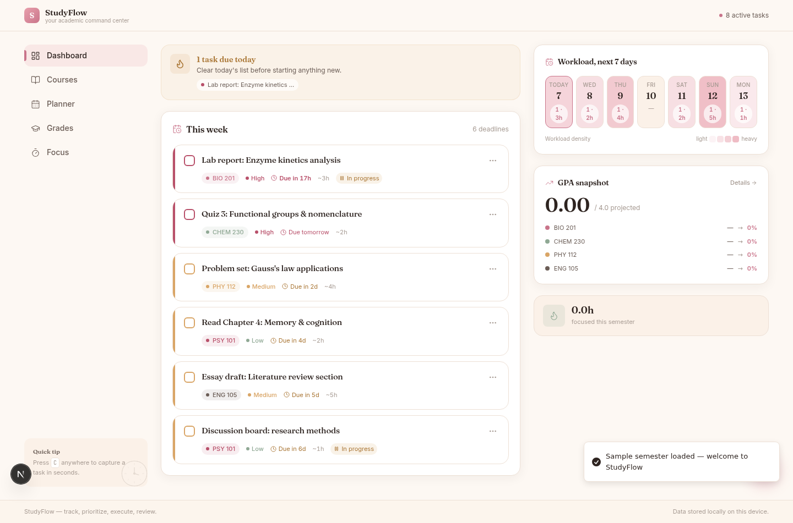
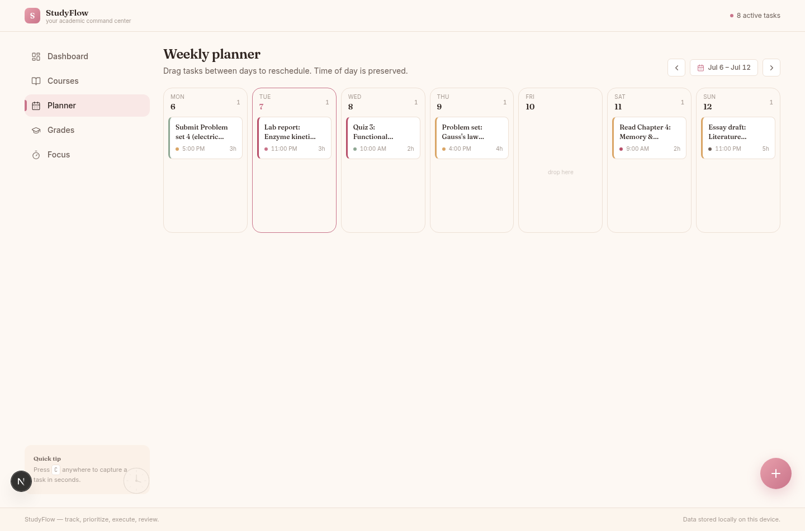
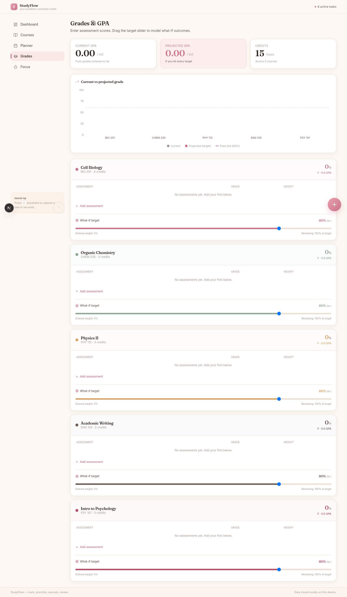

<div align="center">

# 🌸 StudyFlow

### Your Academic Command Center

Track deadlines, manage courses, calculate GPA, and stay focused — all in one calm, designed space built for university students.

[](https://nextjs.org)
[](https://react.dev)
[](https://typescriptlang.org)
[](https://tailwindcss.com)
[](https://prisma.io)

</div>

---

## ✨ Features

| Feature | Description |
|---------|-------------|
| **📊 Dashboard** | At-a-glance view of due tasks, weekly workload heatmap, GPA snapshot, and goal progress |
| **📚 Course Manager** | Add courses with custom colors, credit hours, and instructor info |
| **✅ Task Tracker** | Priority-based tasks with urgency escalation, drag-to-reschedule planner |
| **📈 GPA Calculator** | Enter assessments, compare current vs. projected grades, what-if target sliders |
| **🍅 Pomodoro Timer** | Focus timer with task linking, session history, and break reminders |
| **📋 Weekly Planner** | Drag-and-drop board to reschedule tasks across days |
| **🎯 Goals** | Set learning goals, assign tasks, track progress with animated bars |
| **🤖 Flow Bot** | Study buddy chatbot with quick-reply chips for fast navigation |
| **⚡ Quick Capture** | Press `C` anywhere to instantly create a task |

## 📸 Screenshots

<div align="center">

<br/>
<em>Dashboard — due tasks, weekly heatmap, and GPA snapshot</em>
</div>

<br/>

<div align="center">

<br/>
<em>Weekly Planner — drag tasks between days to reschedule</em>
</div>

<br/>

<div align="center">

<br/>
<em>Grades & GPA — current vs. projected with what-if sliders</em>
</div>

---

## 🛠 Tech Stack

| Layer | Technology |
|-------|-----------|
| **Framework** | Next.js 16 (App Router) |
| **UI** | React 19, shadcn/ui, Tailwind CSS 4, Framer Motion |
| **State** | Zustand (client), Prisma + SQLite (server) |
| **Auth** | Custom JWT (bcrypt + jose), httpOnly cookies |
| **Charts** | Recharts |
| **Drag & Drop** | @dnd-kit |
| **Fonts** | Fraunces (headings), Inter (body), JetBrains Mono (timer) |

---

## 🚀 Getting Started

### Prerequisites

- [Bun](https://bun.sh) (recommended) or Node.js 18+
- Git

### Installation

```bash
# Clone the repo
git clone https://github.com/MrYaseen0/StudyFlow-your-academic-command-center.git
cd StudyFlow-your-academic-command-center

# Install dependencies
bun install

# Set up the database
bunx prisma db push
bunx prisma generate

# Start dev server
bun run dev
```

Open [http://localhost:3000](http://localhost:3000) in your browser.

---

## 📁 Project Structure

```
├── src/
│   ├── app/
│   │   ├── api/           # REST API routes (auth, courses, tasks, grades, ...)
│   │   ├── (auth)/        # Login & register pages
│   │   └── page.tsx       # Main SPA entry
│   ├── components/
│   │   ├── ui/            # 48 shadcn/ui components
│   │   └── ...            # AppShell, Dashboard, TaskCard, Timer, ChatBot, etc.
│   └── lib/
│       ├── store.ts       # Zustand global state
│       └── utils.ts       # Helpers
├── prisma/
│   └── schema.prisma      # 7 models: User, Course, Task, Goal, Grade, Session, Attendance
├── public/                # Static assets & campus background
└── db/                    # SQLite database
```

---

## 🔐 Security

- Rate-limited auth endpoints (login: 10 req/15min, register: 5 req/hr)
- bcrypt password hashing + httpOnly JWT cookies
- Per-user data isolation on every query (IDOR-safe)
- Security headers: CSP, X-Frame-Options DENY, HSTS
- Input validation with Zod on all API routes

---

## 📄 License

MIT

---

<div align="center">

**StudyFlow** — track, prioritize, execute, review.

</div>
